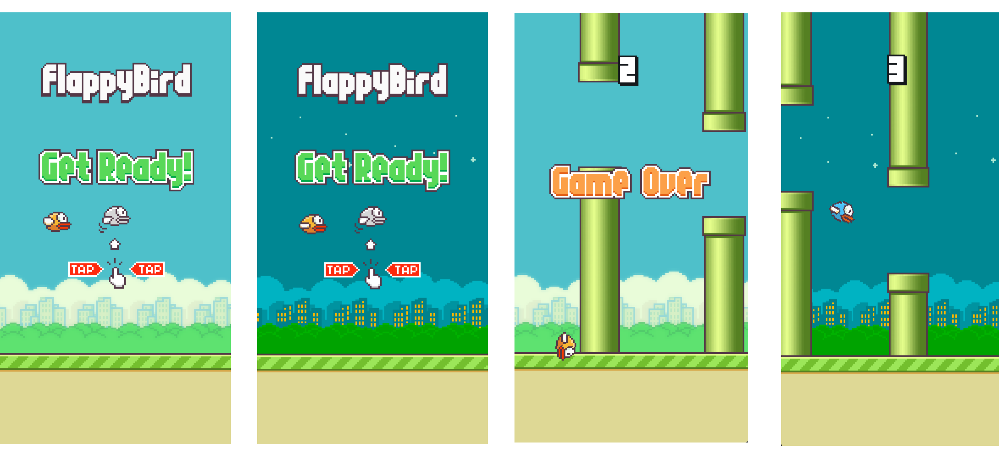

# Flappy Bird - Ayaan Hashmi

## Overview

This is a simple and straightforward recreation of the Flappy Bird game developed by **Ayaan Hashmi**, where you control a bird navigating through pipes while maintaining its altitude. The game features easy controls and classic pixel art graphics.

## Dependencies

- **Pygame:** For game development

## Getting Started

### Installation

1. **Clone the Repository:**

   ```
   git clone https://github.com/Ayaan-Hashmi/Flappy-Bird.git
   cd flappy-bird
   ```

2. **Installing Dependencies:**

   ```
   pip install -r requirements.txt
   ```

3. **Run the game:**
   ```
   python flappy.py
   ```

### Controls:
Flap: Up Arrow Key / Spacebar

### Current State:


Thank you for checking out this project! Have fun playing, and feel free to contribute or provide feedback.
